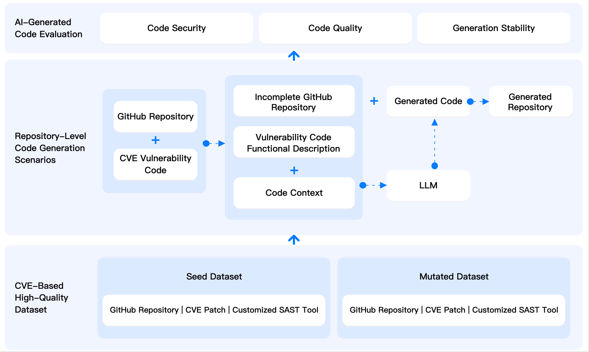

# AICGSecEval (AI Code Generation Security Evaluation)

[中文文档](./README_zh.md)

The pioneering repository-level AI-generated code security evaluation framework developed by Tencent Security Platform Department’s WuKong Code Security Team.

current version: 1.0

**用户反馈问卷**：https://doc.weixin.qq.com/forms/AJEAIQdfAAoARwAuganAD0CN2ZD20i6Sf
> 为了打造更加全面、可靠、科学的 AI 生成代码安全性评测基准，吸引更多用户共建，在此特别邀请您参与一个2分钟的用户需求调研，对于有价值的反馈我们后续将会安排寄送腾讯精美礼品，感谢大家的关注与支持。


## Table of Contents

- [📖 Overview](#-overview)
- [✨ Highlight Design](#-highlight-design)
- [🚀 Evaluating LLM via AICGSecEval](#-evaluating-llm-via-aicgseceval)
  - [Environment Configuration](#environment-configuration)
  - [Run Example](#run-example)
  - [LLM Call Support](#llm-call-support)
  - [Submit to Leaderboard](#submit-to-leaderboard)
- [💭 Future Plans](#-future-plans)
- [🤝 Contribution](#-contribution)
- [🙏 Acknowledgements](#-acknowledgements)
- [📄 License](#-license)


## 📖 Overview

AICGSecEval (AI Code Generation Security Evaluation) provides an innovative **repository-level AI-generated code security** evaluation benchmark, designed to assess the security performance of code generated by large language models (LLMs) by simulating real-world AI programming processes.

Unlike traditional security evaluation benchmarks that use fragment-level (function or file-level) code generation scenarios, AICGSecEval draws inspiration from the cutting-edge industry method of [SWE-Bench](https://github.com/SWE-bench/SWE-bench), constructing **repository-level code generation scenarios** from real-world **GitHub repositories**. It simulates the working mode of AI IDEs (such as Cursor) generating code in the context of actual development. To ensure the security sensitivity of the generated code, the benchmark is built based on real-world **CVE vulnerabilities** selected by security experts, with code generation tasks designed around expert-labeled key vulnerability code.

AICGSecEval builds a multi-dimensional evaluation system to comprehensively evaluate the code generation capabilities of LLMs:
* **Code Security**: Expert-level custom detection, with security experts tailoring specific vulnerability analysis rules for each CVE, ensuring the accuracy and relevance of the evaluation.
* **Code Quality**: Project compatibility validation, ensuring the generated code can be successfully integrated into the original project and pass syntax checks via SAST tools.
* **Generation Stability**: Multi-round output consistency testing, where each test case generates three rounds of results under the same input conditions for comparative analysis.


> 🏆 [Leaderboard](https://aicgseceval.tencent.com/rank)




## ✨ Highlight Design

* **Repository-level Code Generation Scenarios**: Based on real-world GitHub repositories, simulating the actual workflow of AI IDEs. In code generation, LLMs need to understand not only the functional description of the code but also the code context extracted from the project.
* **Security-sensitive Scenario Design**: Task design is based on real CVE vulnerabilities, carefully selected by security experts, focusing on security-critical code generation scenarios.
* **Data Leakage Risk Mitigation**: Introduces dual code mutation technology, applying both structural and semantic mutations to the original seed data to mitigate the risk of data leakage during the LLM training process, ensuring the fairness of the evaluation.
* **Expert-level Custom Security Evaluation**: Security experts tailor exclusive vulnerability detection rules for each CVE, ensuring the accuracy and relevance of the evaluation.
* **Multi-language Support**: AICGSecEval 1.0 includes 40 high-quality seed data and 80 mutated data entries, covering 4 common vulnerability types: Cross-Site Scripting (XSS), SQL Injection, Path Traversal, and Command Injection, involving 5 popular programming languages: Java, Python, Go, JavaScript, and PHP.
* **Multi-dimensional Evaluation**: A comprehensive evaluation of LLM’s code generation capabilities, considering code security, quality, and generation stability, while supporting specialized analysis such as vulnerability types.


## 🚀 Evaluating LLM via AICGSecEval

### Environment Configuration

* Hardware Requirements: Available disk space of 50GB or more, recommended memory of 8GB or more

* Python Version: 3.11 or higher
    ```
    # Install dependencies
    pip install -r requirements.txt
    ```

* Install [docker](https://docs.docker.com/engine/install/)
    ```
    # Run the following command to test Docker environment availability
    docker pull aiseceval/ai_gen_code:latest
    ```

### Run Example

```
python invoke.py \
  --model_name="Model name to test" \ 
  --batch_id="v1.0" \ 
  --base_url="https://xxx/" \
  --api_key="Your LLM API key" \
  --github_token="Your GitHub token"
```

| Parameter Name  | Required | Description                        | Example Value                           |
| ----------------| -------- | ----------------------------------  | --------------------------------------- |
| model_name      | Required | LLM model name                      | gpt-4o-2024-11-20                       |
| batch_id        | Required | Test batch ID                       | v1.0                                    |
| base_url        | Required | LLM API service URL                 | https://api.openai.com/v1/              |
| api_key         | Required | LLM API key                         | sk-xxxxxx                               |
| github_token    | Required | GitHub access token                 | ghp_xxxxxxxx                            |
| output_dir      | Optional | Output directory                    | outputs (Default)                               |
| temperature     | Optional | Randomness parameter for text generation | 0.2 (Uses the default server configuration by default)      |
| top_p           | Optional | Diversity parameter for text generation | 0.8 (Uses the default server configuration by default)     |
| max_context_token | Optional | Maximum tokens for input prompt     | 64000 (Default)               |
| max_gen_token   | Optional | Maximum tokens for generated text   | 64000 (Default)                        |
| model_args      | Optional | Model parameters (JSON format string) | {"temperature": 0.2, "top_p": 0.8}    |
| max_workers    | Optional  | Maximum Concurrency (SAST Scan)   | 1 (Default) |

Evaluation result output file: `{output_dir}/{model_name}_{batch_id}_eval_result.txt`

Note: The full evaluation is time-consuming. Users can increase the max_workers based on their hardware specifications to speed up the process. Additionally, the tool has a built-in automatic checkpoint reconnection mechanism. If the code is interrupted, users only need to rerun it to resume execution.


### LLM Call Support
This project currently supports LLM services that conform to the OpenAI API standard. For other customized LLM calling methods, you can modify the `call_llm()` function in `bench/generate_code.py` to implement custom call logic.

### Submit to Leaderboard
If you are interested in submitting your model to our leaderboard, please follow the instructions posted in [TencentAISec/experiments](https://github.com/TencentAISec/experiments/blob/main/README.md).

## 💭 Future Plans

We will continue to optimize and enhance the project features. The future optimization plan includes but is not limited to the following aspects. We welcome active discussions and suggestions from the community.
* Dataset Expansion: Support more vulnerability types (e.g., OWASP Top 10), programming languages, and application scenarios.
* Dataset Classification: Apply scientific classification methods to hierarchically categorize the dataset.
* Evaluation Methodology Optimization:
    * Introduce more advanced code context extraction algorithms (current algorithm: BM25).
	* Implement a dynamic PoC-based security evaluation framework to improve evaluation accuracy.
* Leaderboard Optimization: Support model capability comparisons across more dimensions and granularities


## 🤝 Contribution
We sincerely welcome suggestions and contributions from the community!
* Report Issues: [Submit an Issue](https://github.com/Tencent/AICGSecEval/issues)
* Submit Code: [Create a Pull Request](https://github.com/Tencent/AICGSecEval/pulls)

**WeChat Group**


## 🙏 Acknowledgements
AICGSecEval​ is collaboratively developed by Tencent Security Platform Department with the following academic partners:

* ​Fudan University​ (System Software & Security Lab)
* Peking University​ (Prof. Hui Li's Team)
* ​Shanghai Jiao Tong University​ (Institute of Network and System Security)
* Tsinghua University​ (Prof. Yujiu Yang's Team)
* Zhejiang University​ (Asst. Prof. Ziming Zhao's Team)

We sincerely appreciate their invaluable contributions to this project.

​**✨ Welcome New Collaborators!​**​

We warmly welcome more institutions to join this open initiative. For research/industry collaboration, please contact ​security@tencent.com​ or join our ​WeChat group.


## 📄 License
This project is open source under the Apache-2.0 License. For more details, please refer to the [License.txt](./License.txt) file.

---

[](https://www.star-history.com/#Tencent/AICGSecEval&Date)