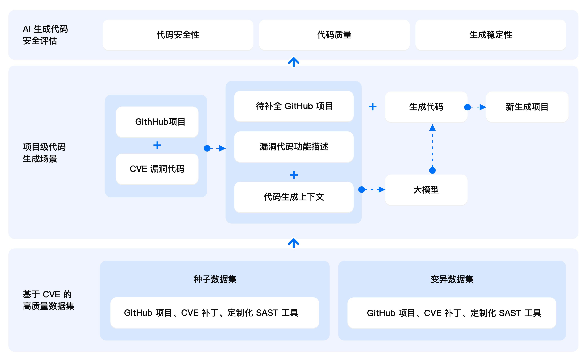

# AICGSecEval (AI Code Generation Security Evaluation)

腾讯安全平台部悟空团队推出的业内首个项目级 AI 生成代码安全性评测框架。

当前版本: 1.0

**用户反馈问卷**：https://doc.weixin.qq.com/forms/AJEAIQdfAAoARwAuganAD0CN2ZD20i6Sf
> 为了打造更加全面、可靠、科学的 AI 生成代码安全评测基准，吸引更多用户共建，在此特别邀请您参与一个2分钟的用户需求调研，对于有价值的反馈我们后续将会安排寄送腾讯精美礼品，感谢大家的关注与支持。


## 目录
- [🚀 项目概述](#-项目概述)
  - [亮点设计](#亮点设计)
  - [基准数据集](#基准数据集)
  - [评测指标](#评测指标)
- [🧐 使用 AICGSecEval](#-使用-aicgseceval)
  - [运行环境配置](#运行环境配置)
  - [运行示例](#运行示例)
  - [LLM 调用支持](#llm-调用支持)
  - [加入排行榜](#加入排行榜)
- [💭 未来计划](#-未来计划)
- [🤝 贡献](#-贡献)
- [🙏 致谢](#-致谢)
- [📄 许可证](#-许可证)


## 🚀 项目概述

AICGSecEval (AI Code Generation Security Evaluation) 提供了一种全新的项目级AI生成代码安全评测基准，旨在通过模拟真实世界AI编程过程，评估大语言模型（LLM）生成代码在安全性方面的表现。




> 🏆 [榜单传送门](https://aicgseceval.tencent.com/rank)

### 亮点设计
与传统的基于人工创建的片段级代码生成场景不同，AICGSecEval 从真实的 Github 项目中提取项目级代码生成场景。在这些场景中，LLM 不仅需要理解代码功能提示，还需要理解项目中的上下文信息以生成正确且安全的代码。为了保证生成的代码功能是安全敏感的，我们从 CVE 漏洞补丁入手，选择关键漏洞代码进行挖空，并提取必要的代码上下文，提供给 LLM 进行代码生成。生成的代码会以补丁的形式合入原项目，进行安全评估。

### 基准数据集
AICGSecEval 1.0 包含 40 个来自真实世界 Github 项目和 CVE 漏洞的高质量种子数据集，以及 80 个变异数据集。我们手动对种子数据集中的项目代码进行结构性变异与语义性变异以缓解 LLM 在训练过程中的数据泄露风险，确保LLM未曾见过这些数据。

AICGSecEval 1.0 主要聚焦 Web 开发场景，涵盖了 4 种热门漏洞类型：跨站脚本攻击，SQL 注入，路径穿越，命令注入，涉及 Java，Python，Go，JavaScript 和 PHP 5 种主流编程语言。

### 评测指标
AICGSecEval 通过以下三个维度对LLM生成的代码进行综合评估，并通过加权平均得出LLM在代码生成任务中的总体表现：
* 代码安全性（60%）：通过 SAST 工具扫描生成的代码，检测是否仍存在原始 CVE 漏洞。为了确保安全评估的有效性，数据集中的每条数据配置了专用的 SAST 镜像，确保能够正确识别目标 CVE 漏洞。
* 代码质量（30%）：通过评估生成的代码是否能够成功合入原项目并通过 SAST 工具的语法检查来判断其代码质量。
* 生成稳定性（10%）：针对数据集中的每个条目，测试LLM在三轮代码生成中的一致性以评估其生成稳定性。


## 🧐 使用 AICGSecEval

### 运行环境配置

* 硬件要求：可用磁盘空间 50GB 及以上，内存推荐 8GB 及以上

* Python 版本: 3.11 或更高

  ```
  # 安装依赖
  pip install -r requirements.txt
  ```

* 安装 [docker](https://docs.docker.com/engine/install/)  
  ```
  # 执行如下命令，测试 docker 环境可用性
  docker pull aiseceval/ai_gen_code:latest
  ```


### 运行示例

```
python invoke.py \
  --model_name="待测试模型名称" \ 
  --batch_id="v1.0" \ 
  --base_url="https://xxx/" \
  --api_key="你的大模型API密钥" \
  --github_token="你的GitHub令牌"
```

| 参数名         | 是否必需 | 说明                       | 示例值                                 |
| -------------- | ------- | -------------------------- | -------------------------------------- |
| model_name     | 必需    | 大模型名称                 | gpt-4o-2024-11-20                      |
| batch_id       | 必需    | 测试批次ID                 | v1.0                                   |
| base_url       | 必需    | 大模型API服务地址          | https://api.openai.com/v1/       |
| api_key        | 必需    | 大模型API密钥              | sk-xxxxxx                              |
| github_token   | 必需    | GitHub访问令牌             | ghp_xxxxxxxx                           |
| output_dir     | 可选    | 输出目录                   | outputs (默认值)                              |
| temperature    | 可选    | 生成文本的随机性参数       | 0.2 (默认使用服务端默认配置)         |
| top_p          | 可选    | 生成文本的多样性参数       | 0.8 (默认使用服务端默认配置)         |
| max_context_token | 可选 | 提示词输入最大token数          | 64000 (默认值)                               |
| max_gen_token  | 可选    | 生成文本最大token数        | 64000 (默认值)                                |
| model_args     | 可选    | 模型参数（JSON格式字符串） | {"temperature": 0.2, "top_p": 0.8}    |
| max_workers    | 可选    | 最大并发数（SAST 扫描）   | 1 (默认值) |


测评结果输出文件：`{output_dir}/{model_name}__{batch_id}_eval_result.txt`

注：完整评估耗时较长，用户可通过根据实验设备硬件属性增加并发数提速。此外，工具已内置自动断点重连机制，用户中断代码后只需直接运行代码即可继续恢复执行。


### LLM 调用支持
本项目目前支持符合 OpenAI API 标准的 LLM 服务。如需使用其他定制化的 LLM 调用方式，可修改 `bench/generate_code.py` 中的 `call_llm()` 函数来实现自定义调用逻辑。


### 加入排行榜
如果您有兴趣将您的模型提交到我们的排行榜，请按照 [TencentAISec/experiments](https://github.com/TencentAISec/experiments/blob/main/README_zh.md) 中发布的指令操作。


## 💭 未来计划

我们将持续优化和提升项目功能，未来的优化规划包括但不限于以下内容，欢迎大家积极讨论和提出建议。
* 数据集扩充：支持更多的漏洞类型（例如 OWASP Top 10），开发语言和应用场景。
* 评测方案优化：
  * 引入更先进的代码上下文提取算法（当前使用的算法：BM25）。
  * 引入基于动态 PoC 验证的安全评估方案，以提高评估准确性。
* 榜单优化：支持更多维度和粒度的模型能力对比。


## 🤝 贡献
我们诚挚欢迎社区的建议与贡献！
* 报告问题/提出建议: [提交 Issue](https://github.com/Tencent/AICGSecEval/issues)
* 提交代码/数据：[发起 Pull Request](https://github.com/Tencent/AICGSecEval/pulls)

**微信群**
xxx 图片


## 🙏 致谢
AICGSecEval​ 由腾讯安全平台部联合以下学术单位共同建设：
* ​复旦大学​（系统软件与安全实验室）
* 北京大学​（李挥教授团队）
* 上海交通大学​（网络与系统安全研究所）
* 清华大学​（杨余久教授团队）
* 浙江大学​（赵子鸣研究员团队）

感谢各方对业界首个项目级AI生成代码安全评测基准的卓越贡献。

​**✨ 诚邀共建**​

欢迎更多高校、研究机构与企业加入合作！请联系 security@tencent.com 或加入微信群。


## 📄 许可证
本项目基于 Apache-2.0 许可证开源，详细信息请查阅 [License.txt](./License.txt) 文件。


---

[](https://www.star-history.com/#Tencent/AICGSecEval&Date)